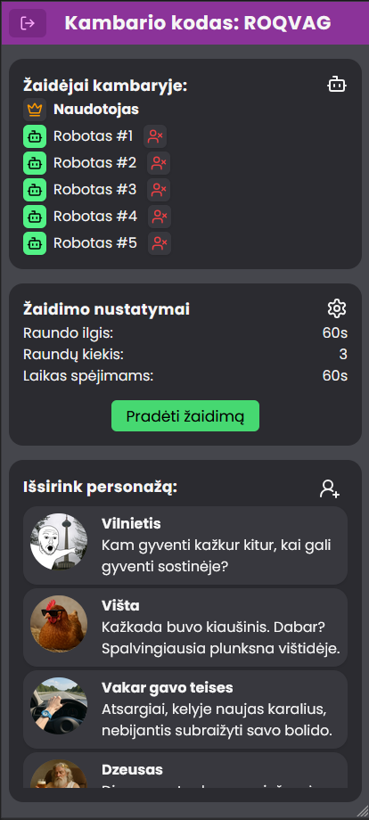
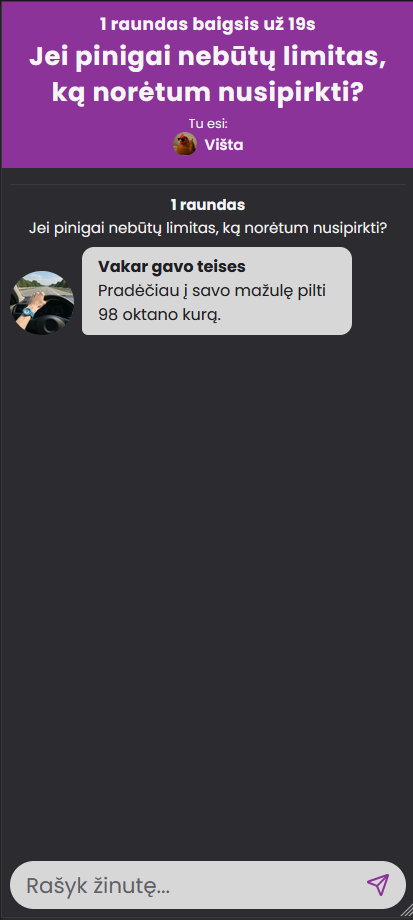
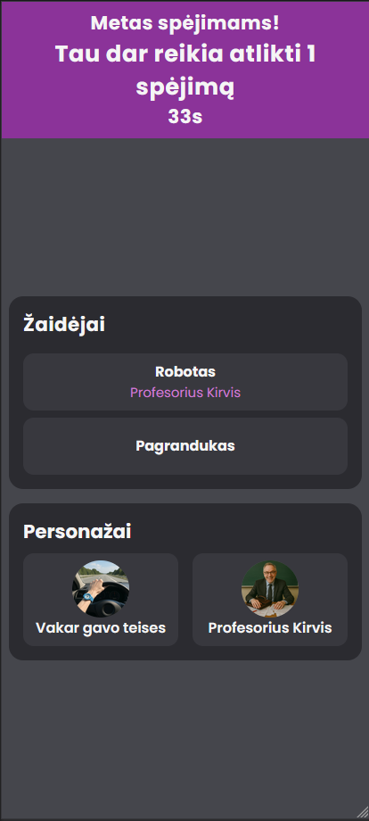
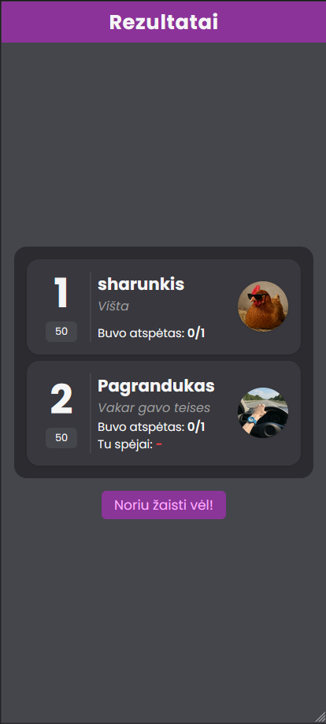

# Meidvainis
A fun web-based role-playing & social-deduction game, developed as part of a bachelor’s thesis. Players pick or create characters, answer prompts, chat, and then anonymously guess who is who.

## Features

- **Real-time rounds & chat** via Django Channels & WebSockets  
- **AI “bot” players** powered by DeepSeek (OpenAI-compatible)  
- **Custom character creation** (with image upload)  
- **Social deduction**: answer, guess, scoring, and reveal phases  
- **REST API** with JWT auth (Simple JWT)  
- **Containerized** with Docker, Compose, Redis, Postgres, Celery & Celery-Beat 

## 📸 Screenshots
### Lobby - pending


### In-Game Chat


### Guessing phase


### Final results


## How do i run this?
- `git clone https://github.com/mostghoste/RpgForSocialInteraction`
- `cp .env.example .env`
- In `.env`, configure `DJANGO_SECRET_KEY` to a secure string and add `DEEPSEEK_API_KEY` (optional)
- `docker compose up --build`
- Populate the DB with default characters and questions with `docker compose exec backend python manage.py populate_db` (optional)
- Visit the frontend at http://localhost:3000 and the admin at http://localhost:8000/admin.

`docker compose up` might not fully work on the first run, try again if it fails.

## Project Structure
```
/
├── backend/                # Django + Channels + Celery
│   ├── backend/            # Django project
│   ├── game/               # Game app (models, consumers, tasks…)
│   ├── users/              # Authentication  
│   ├── Dockerfile
│   └── requirements.txt
├── frontend/               # SvelteKit + Skeleton UI
│   ├── src/
│   ├── Dockerfile
│   └── package.json
├── docker-compose.yml
├── .env.example
└── README.md
```

## Testing
Run tests with `docker compose exec backend pytest --disable-warnings --cov=game --cov-report=term-missing   --cov-report=html -vv`